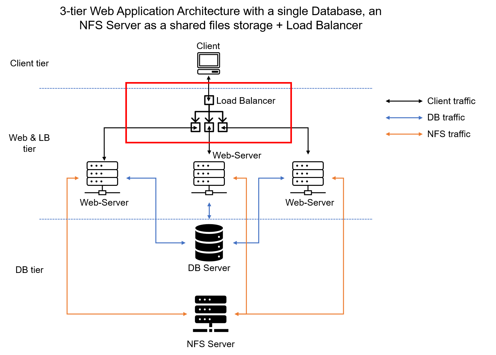

## LOAD BALANCER SOLUTION WITH APACHE

In our set up in Project-7 we had 3 Web Servers and each of them had its own public IP address and public DNS name. A client has to access them by using different URLs, which is not a nice user experience to remember addresses/names of even 3 server, let alone millions of Google servers.

In order to hide all this complexity and to have a single point of access with a single public IP address/name, a Load Balancer can be used. A Load Balancer (LB) distributes clients’ requests among underlying Web Servers and makes sure that the load is distributed in an optimal way.

Let us take a look at the updated solution architecture with an LB added on top of Web Servers (for simplicity let us assume it is a software L7 Application LB, for example – Apache, NGINX or HAProxy)

